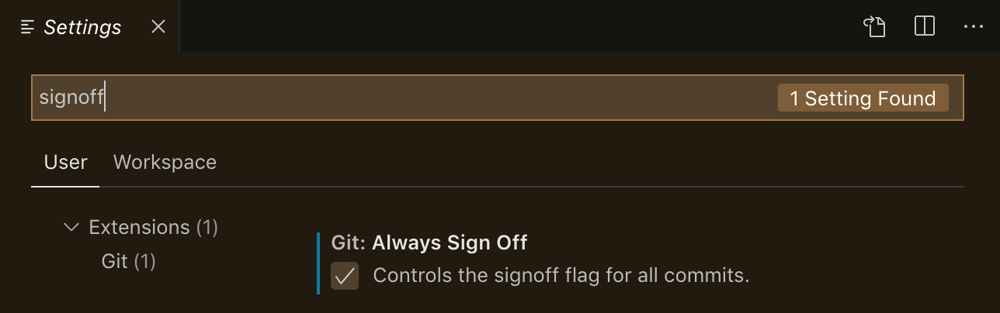

## Contributor Instructions

Before building the site, ensure that you have the following dependencies installed on your system.

- [Nodejs and npm](https://nodejs.org/en/): To verify run `node -v` & `npm -v`

### Building the site

Run the following:

1. `cd TemplateRun.io`
2. `make setup`
3. `make site`

Please contribute! The TemplateRun site uses Gatsby. The process of contributing to documentation follows this flow:

1. Fork a copy of this repo.
1. Get a local clone of your fork of the site.
   `git clone https://github.com/TemplateRun/TemplateRun.io`
1. Switch to the `main` branch.
   `git checkout main`
1. Create and checkout a new branch to make changes within
   `git checkout -b <my-username>/<my-changes>`
1. Edit site/add content.
   `vi <specific page>.md` # or use your favorite IDE
1. Run site locally to preview changes.
   `make site` # this will run a local web server with "live reload" conveniently enabled.
1. Commit your changes to your remote branch.
   `git commit --signoff -m"<commit subject>`
1. Push your changes
   `git push origin <my-username>/<my-changes>`
1. Open a [pull request](../../pulls) (in your web browser) against the `master` branch on https://github.com/TemplateRun/TemplateRun.io.

### <a name="commit-signing">Signing-off on Commits (Developer Certificate of Origin)</a>

To contribute to this project, you must agree to the Developer Certificate of
Origin (DCO) for each commit you make. The DCO is a simple statement that you,
as a contributor, have the legal right to make the contribution.

See the [DCO](https://developercertificate.org) file for the full text of what you must agree to
and how it works [here](https://github.com/probot/dco#how-it-works).
To signify that you agree to the DCO for contributions, you simply add a line to each of your
git commit messages:

```
Signed-off-by: Taylor Swift <Taylor.swift@example.com>
```

In most cases, you can add this signoff to your commit automatically with the
`-s` or `--signoff` flag to `git commit`. You must use your real name and a reachable email
address (sorry, no pseudonyms or anonymous contributions). An example of signing off on a commit:

```
$ commit -s -m “my commit message”
```

To ensure all your commits are signed, you may choose to add this alias to your global `.gitconfig`:

_~/.gitconfig_

```
[alias]
  amend = commit -s --amend
  cm = commit -s -m
  commit = commit -s
```

Or you may configure your IDE, for example, Visual Studio Code to automatically sign-off commits for you:

<a href="./.github/assets/images/git-signoff-vscode.png" ><a>
